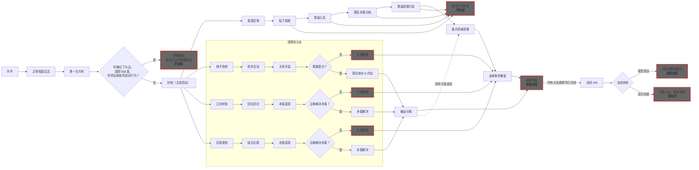

```mermaid
flowchart LR
    %% ===== 结局样式 =====
    classDef ending fill:#666,stroke:#f00,stroke-width:2px

    %% ===== 序章与前期抉择 =====
    M1[开学] --> M2[正常校园生活] --> M3[第一次月考]
    M3 --> Pre1{你被记了大过。<br>因处分从宽，<br>你供出朋友的违纪行为？}
    Pre1 -->|是| TLBE1[背叛朋友<br>成为兰山计划牺牲品<br><b>坏结局</b>]:::ending
    Pre1 -->|否| M4[封校（主线启动）]

    %% ===== 核心主线流程 =====
    M4 --> TL1[发现异常]
    TL1 --> TL2[私下探索] --> TL3[漆诚入队]
    TL3 --> TL4[团队矛盾分歧] --> TL5[漆诚营救行动]
    TL5 --> TL6[重大突破进展] --> TL7[龙杨事件爆发]
    TL7 --> TL8[逃离学校<br><b>普通结局</b>]:::ending

    %% ===== 主线行动失败（坏结局） =====
    TL2 --> TLBE[单次行动失败<br><b>坏结局</b>]:::ending
    TL3 --> TLBE
    TL4 --> TLBE
    TL5 --> TLBE

    %% ===== 感情线分支（平行时空） =====
    subgraph GL[感情线分支]
        direction LR
        GL1[林子欣线] --> GL1_1[初步互动] --> GL1_2[关系升温]
        GL1_2 --> GL1_3{勇敢表白？}
        GL1_3 -->|否| GL1BE[关系断绝]:::ending
        GL1_3 -->|是| GL1_4[表白成功 & 约会]

        GL2[江诗轩线] --> GL2_1[回忆初识] --> GL2_2[矛盾显现]
        GL2_2 --> GL2_3{正确解决矛盾？}
        GL2_3 -->|否| GL2BE[关系断绝]:::ending
        GL2_3 -->|是| GL2_4[矛盾解决]

        GL3[石晴雯线] --> GL3_1[结识过程] --> GL3_2[矛盾显现]
        GL3_2 --> GL3_3{正确解决矛盾？}
        GL3_3 -->|否| GL3BE[关系断绝]:::ending
        GL3_3 -->|是| GL3_4[矛盾解决]
    end

    %% ===== 封校连接到各感情线起始（补全缺失连线） =====
    M4 --> GL1
    M4 --> GL2
    M4 --> GL3

    %% ===== 合并感情线结果 =====
    GL1_4 --> GL_End[被迫分离]
    GL2_4 --> GL_End
    GL3_4 --> GL_End

    GL1BE --> TL7
    GL2BE --> TL7
    GL3BE --> TL7

    GL_End --> TL8

    %% ===== 合并道具获取（任一线路成功即可） =====
    GL_End -.->|获得关键道具| TL6

    %% ===== 最终决战 =====
    TL8 -->|所有分支剧情均已完成| M5[决战 040]
    M5 --> FinalChoice{决战抉择}
    FinalChoice -->|接受提议| FalseEnding[活在虚假幸福中<br><b>虚假结局</b>]:::ending
    FinalChoice -->|反抗到底| TrueEnding[打败 040，恢复学校<br><b>真结局</b>]:::ending
```