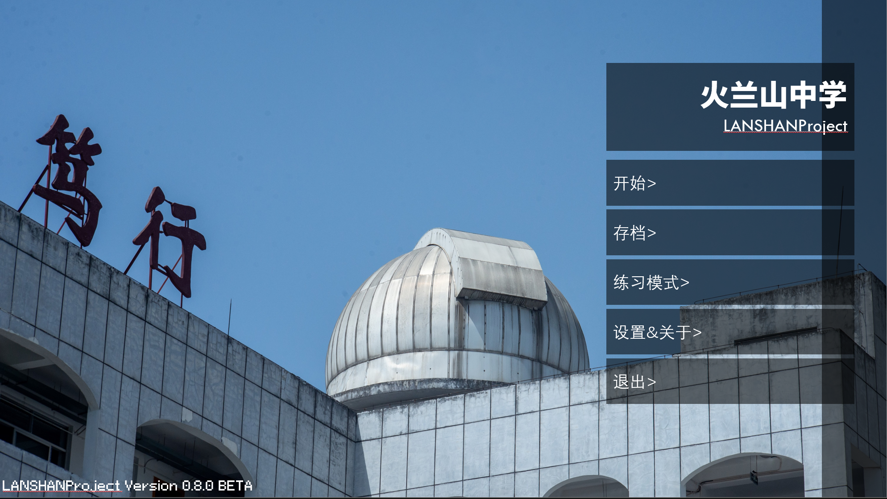
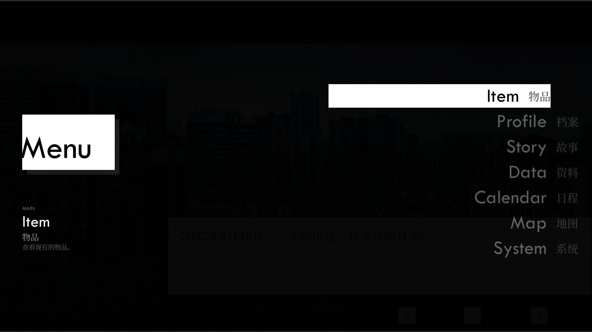
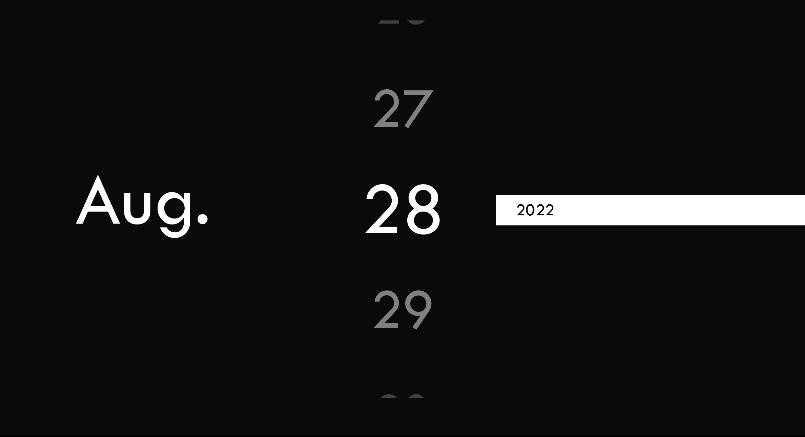
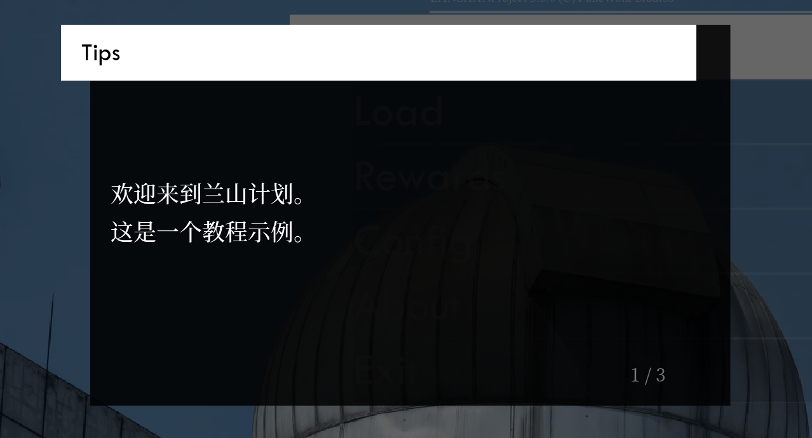
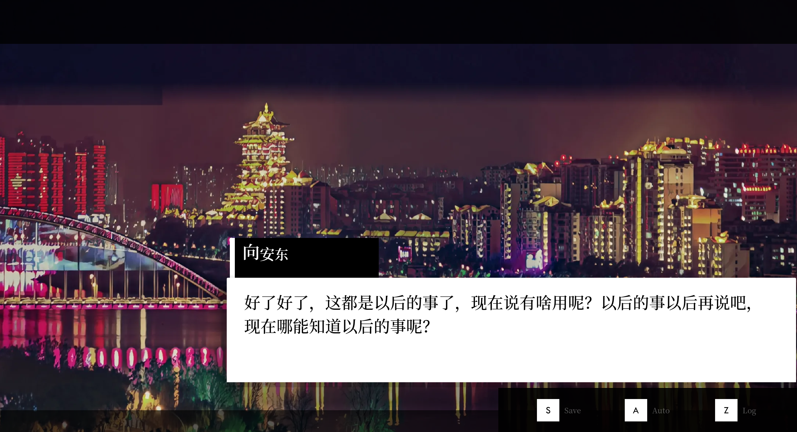
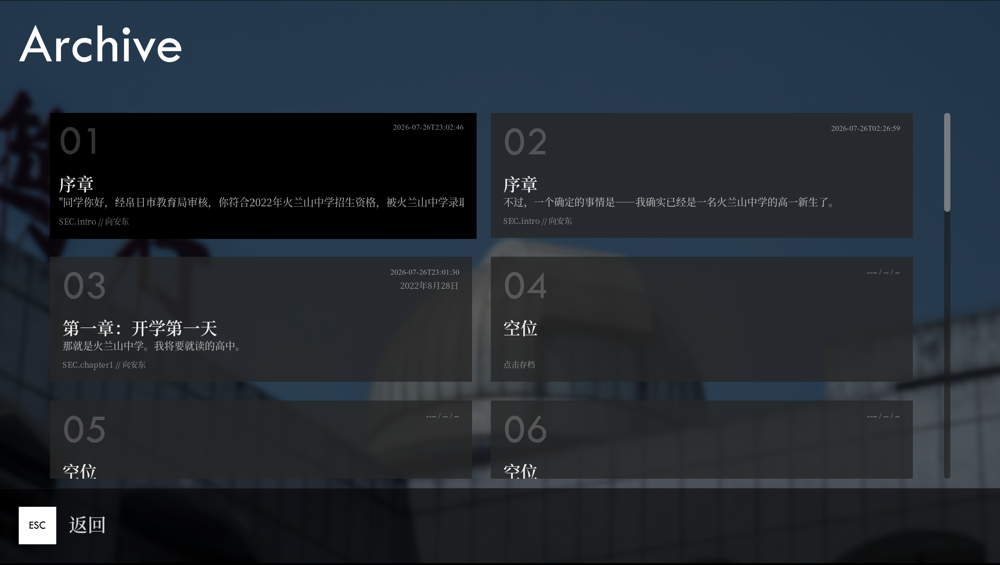
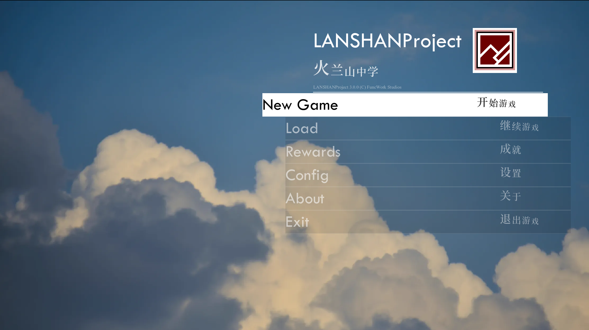

# RE:UI For LANSHANProject

**《火兰山中学》UI设计规范**

*Powered by Konita*

---

本文档主要介绍关于《火兰山中学》的有关设计，以供参考。

在设计这一套UI语言之前，笔者一直斟酌如何介绍这个设计。一方面，它的设计灵感确实出于偶然，而且笔者先前对其的描述相对较于不贴切，因此值得我在这里做一个介绍和规范。

---

## 为什么设计

《火兰山中学》是一款2D RPG解密游戏，玩家将扮演火兰山中学的一名普通学生，在看似寻常的高中生活中试图平稳度过。然而，一场突如其来的封校打破了日常秩序。随着探索深入，主角逐渐察觉到异样，并通过线索整合与推理，揭开了“疫情”背后的真相——校领导主导的生物分子计算机计划，以及幕后更深层的阴谋。危机之下，主角团决定趁乱逃离学校。

游戏主题聚焦于**成长**与**反抗**，因此其视觉语言需要具备**打破常规**的特质，以契合叙事张力与情感基调。

---

## 设计语言及其渊源

回顾早期设计版本，存在若干显著问题：**交互性薄弱**、**视觉风格不统一**，以及**过于沉稳保守**。尽管“稳重”本身并无过错，但它与游戏的反叛主题格格不入，且仍有明显优化空间。为此，笔者决定彻底推翻重来，重构整套UI体系。

*图1 早期UI设计方案*

所以，这里简要记叙一下笔者的总体设计思路。

首先，故事背景设定在**学校**之中。校园生活离不开书本与教辅，其印刷多以黑白为主；同时，高中阶段接触的漫画、小说也多为黑白呈现。而故事又涉及**计算机**元素，命令行界面通常亦为黑白配色。此外，黑白两色也隐喻着单调乏味的日常**生活**。基于这些关联，我们确立了黑白作为UI的主色调。

其次，剧情内核是建立在理性之上的反叛精神，这天然适配框架化、构成感强烈的视觉表达。在设计史上，这种风格可归入**解构主义**的范畴（参见下图）。因此，大面积的矩形块面、大胆的黑白对比，构成了整体设计的基调。

在此基础上衍生，可以得到一个简单的菜单样式。

​	*图3 示例菜单样式（Tab菜单）*

相对应的，有些设计也可以是这样：

​	*图4 时间切换过场动画（v0.1.3）*

​	*图5 提示窗口*

然后再加拓展，可以得到：

​	*图6 VN*

​	*图7 存档页*

​	*图8 主页*

顺带一提，每一位主要角色都有着对应的主题色（参见DesignSet.md），作为对应相对应菜单（如专有介绍页）的第三色，用以区分角色和彰显个性。

## 关于未设计的部分

目前未能设计的部分包括：

- 主关卡1-9的详细UI（未定）
- 终端UI（未定）
- Profile页：人物详情页，包含：
  - 人物立绘
  - 人物姓名
  - 相应介绍（可随着剧情发展或好感度发展变化）
  - 支线故事进入选项
- Story页：故事简介页，主要包含：
  - 每段剧情的简要概述
- 地点切换动画（参见Map菜单的移动方式）：
  - 如何巧妙的切换地点？
  - 时间切换过场动画的流畅性

另：“Data”资料页仅供调试，在正式版本中会删除